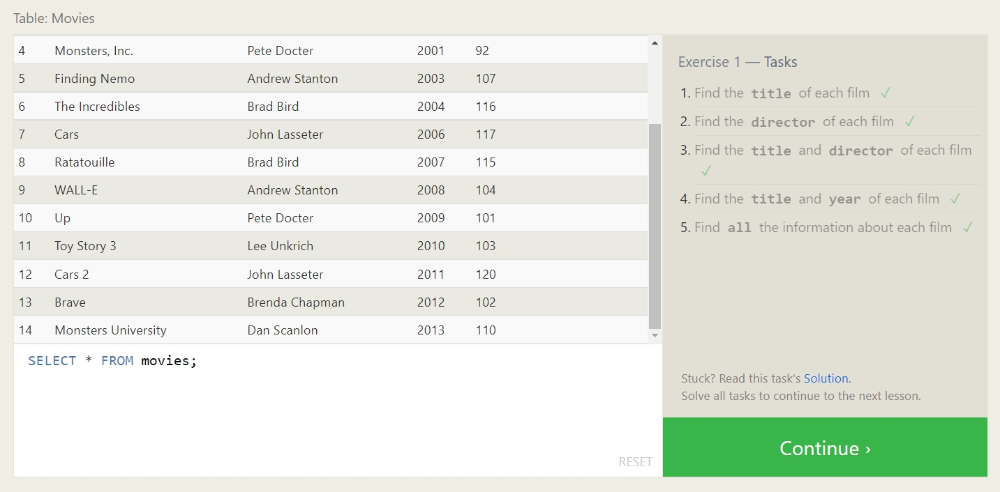
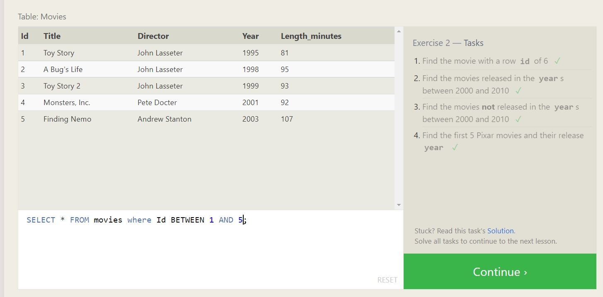
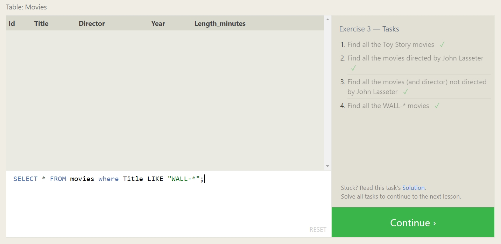
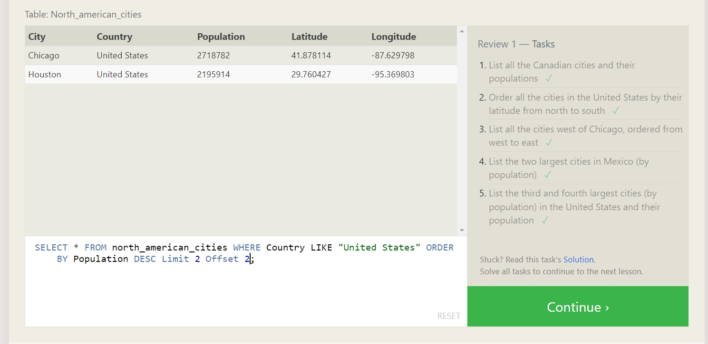
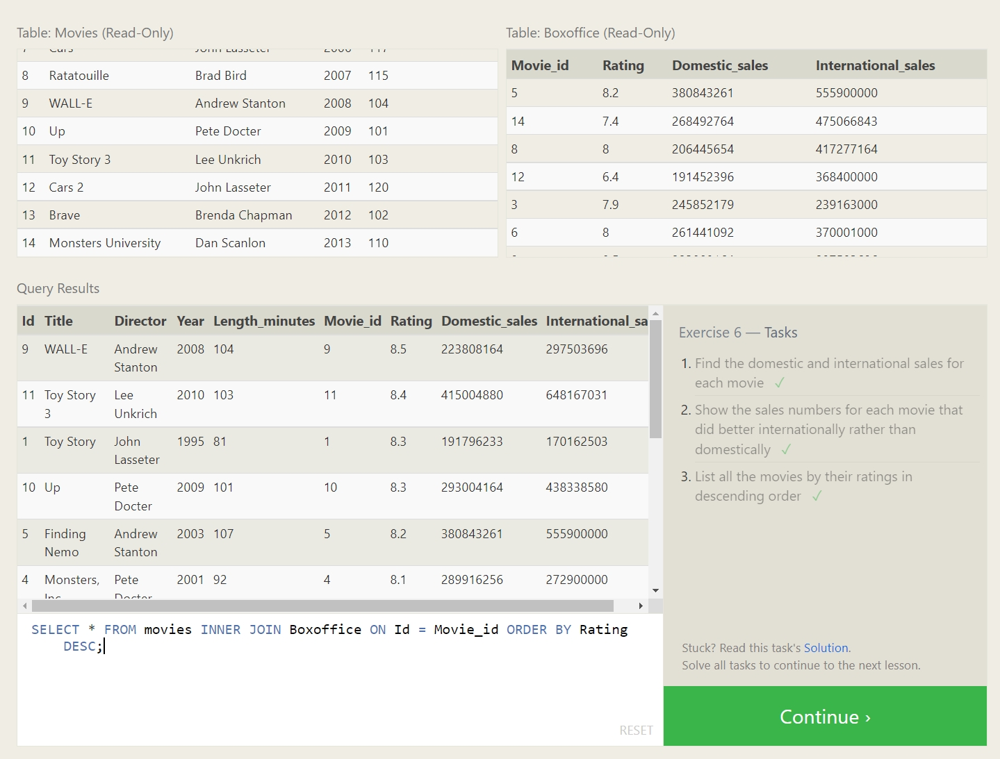
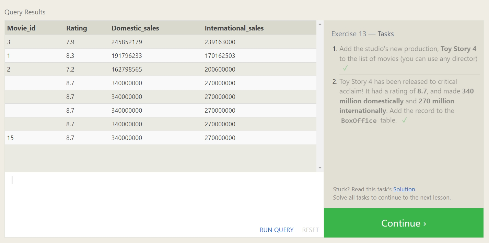
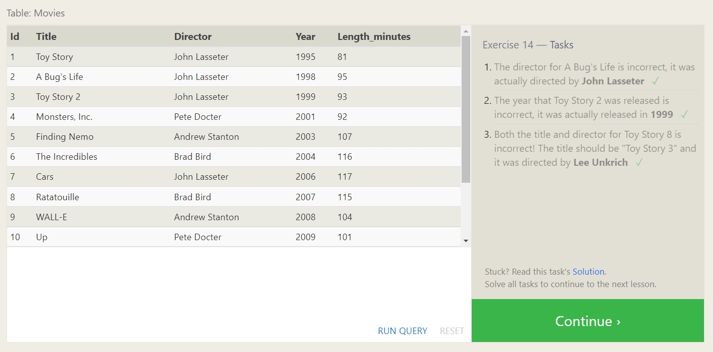
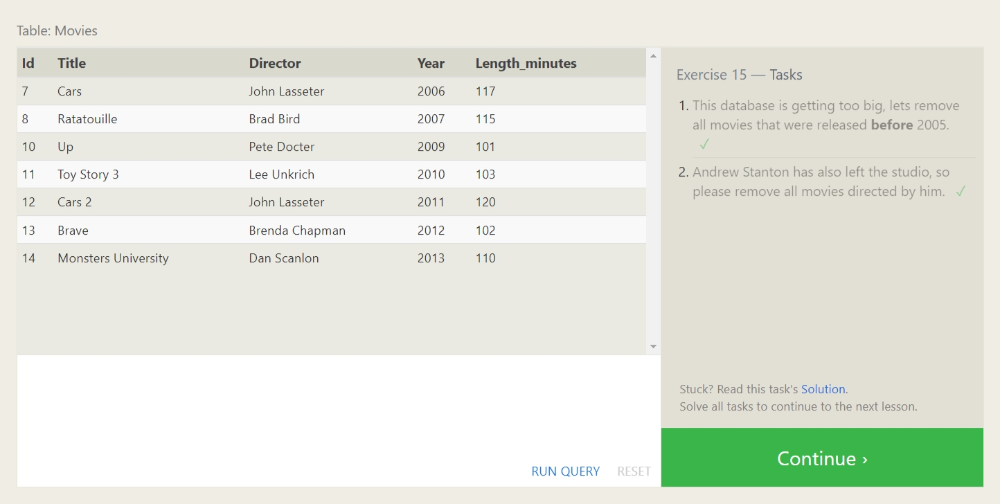
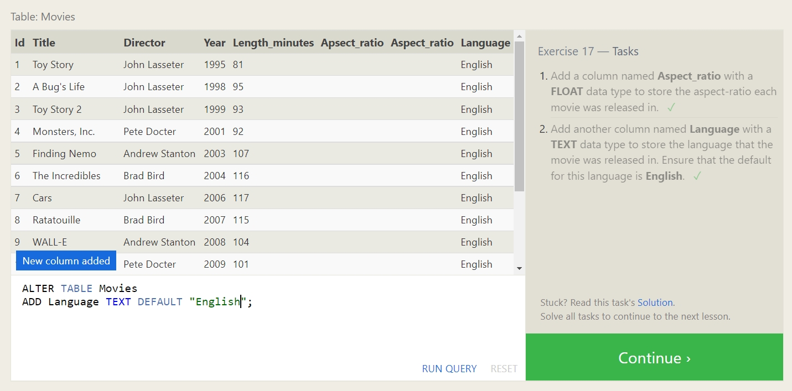
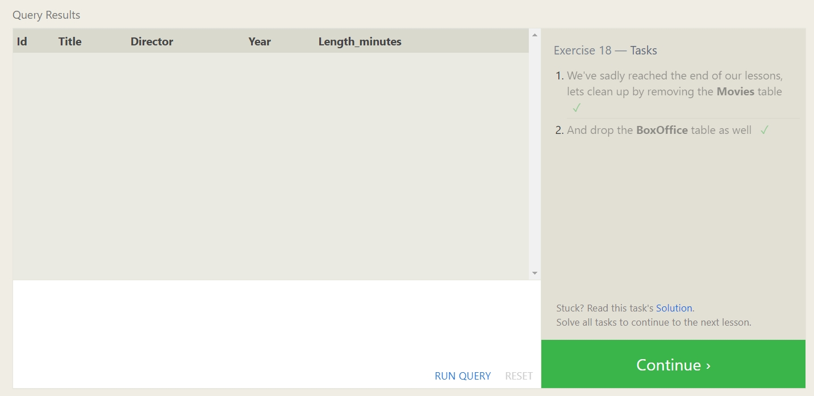

# Introduction to SQL

## Summary of SQL and Relational Databases

- SQL (Structured Query Language) allows you to request specific information you'd like to receive from a database
- Databases store information in *tables* (similar to MS Excel)
- There are many commands used in SQL to communicate with the database, including:
  - SELECT (to fetch/get data)
  - FROM (to instruct which table to get data from)
  - ORDER BY (to sort data in a specific order)
  - LIMIT (number to limit by)
  - OFFSET (number of rows to skip)
  - WHERE (to filter down resulting info from a query, using conditional operators)
  - GROUP BY
  - JOIN (to combine data in multiple tables based on a shared key)
- Using these commands (and others) allows us to extract, combine, alter, and otherwise work with data in databases in many ways!

## SQL Bolt Tutorials

[Back to Home](../README.md)
